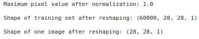
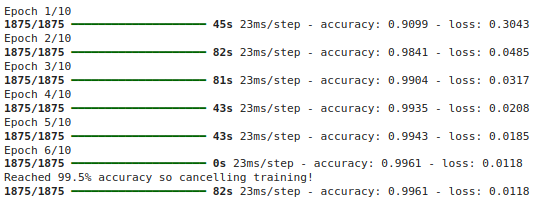

# Implementation-of-CNN

## AIM

To Develop a convolutional deep neural network for digit classification.

## Problem Statement and Dataset

## Neural Network Model


## DESIGN STEPS

### STEP 1:
Import Libraries.
### STEP 2:
Load MNIST Data.
### STEP 3:
Inspect Data.
### STEP 4:
Define Convolutional Model.
### STEP 5:
Define Reshape and Normalize Function.
### STEP 6:
Apply Reshape and Normalize.
### STEP 7:
Define Early Stopping Callback.
### STEP 8:
Train the model.

## PROGRAM

#### Name: Sam Israel D
#### Register Number: 212222230128


##### Import Libraries:
```python
import numpy as np
import tensorflow as tf
```
##### Load MNIST Data:
```python
data_path = 'mnist.npz'

(training_images, training_labels), _ = tf.keras.datasets.mnist.load_data(path=data_path)
```
##### Inspect Data:
```python
print(f"training_images is of type {type(training_images)}.\ntraining_labels is of type {type(training_labels)}\n")

data_shape = training_images.shape

print(f"There are {data_shape[0]} examples with shape ({data_shape[1]}, {data_shape[2]})")
```
##### Define Convolutional Model:
```python

def convolutional_model():
    
    model = tf.keras.models.Sequential([
        tf.keras.Input(shape = (28, 28, 1)),
        tf.keras.layers.Conv2D(32, (3,3), activation = 'relu'),
        tf.keras.layers.MaxPooling2D(2,2),
        tf.keras.layers.Conv2D(32, (3,3), activation='relu'),
        tf.keras.layers.MaxPooling2D(2,2),  
        tf.keras.layers.Flatten(),
        tf.keras.layers.Dense(128, activation='relu'),
        tf.keras.layers.Dense(10, activation='softmax')        
    ]) 

    model.compile(
		optimizer='adam',
		loss='sparse_categorical_crossentropy',
		metrics=['accuracy']
	)

    return model
```
##### Define Reshape and Normalize Function:
```python

def reshape_and_normalize(images):
    
    images = np.expand_dims(images, axis=-1)
    
    images = images/255.0
    
    return images
```
##### Apply Reshape and Normalize:
```python
(training_images, _), _ = tf.keras.datasets.mnist.load_data(path=data_path)

training_images = reshape_and_normalize(training_images)

print(f"Maximum pixel value after normalization: {np.max(training_images)}\n")
print(f"Shape of training set after reshaping: {training_images.shape}\n")
print(f"Shape of one image after reshaping: {training_images[0].shape}")
```
##### Define Early Stopping Callback:
```python
model = convolutional_model()

class EarlyStoppingCallback(tf.keras.callbacks.Callback):
    
    def on_epoch_end(self, epoch, logs=None):
        
        if logs['accuracy'] >= 0.995:
            
            self.model.stop_training = True

            print("\nReached 99.5% accuracy so cancelling training!") 
```
##### Train the model:
```python
training_history = model.fit(training_images, training_labels, epochs=10, callbacks=[EarlyStoppingCallback()])
```

## OUTPUT

### Reshape and Normalize output



### Training the model output




## RESULT

Thus, a convolutional Deep Neural Network for Digit Classification is developed successfully.
